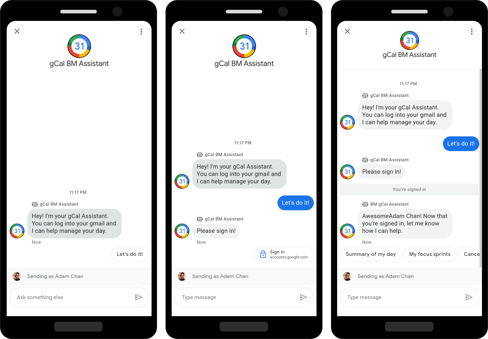

# BUSINESS MESSAGES: Google Calendar App with OAuth 2.0

This sample demonstrates how to integrate with [OAuth 2.0 in Business Messages](https://developers.google.com/business-communications/business-messages/guides/configure/authenticate).

The OAuth provider in this sample is Google. Once you authenticate and provide
authorization to the app, you will be able to request the app to read your
calendar events from today and present it in the conversation.



Once deployed, you can invoke the authorization chip by issuing the command:
* `login` - The bot will send the authorization URL configured with the agent.

## Documentation

The documentation for OAuth 2.0 integration with a Business Messages
conversation can be found [here](https://developers.google.com/business-communications/business-messages/guides/configure/authenticate).

## Prerequisites

You must have the following software installed on your machine:

* [Google Cloud SDK](https://cloud.google.com/sdk/) (aka gcloud)
* [Python](https://www.python.org/downloads/) - version 3.0 or above

## Before you begin

1.  [Register with Business Messages](https://developers.google.com/business-communications/business-messages/guides/set-up/register).
1.  Once registered, follow the instructions to [enable the APIs for your project](https://developers.google.com/business-communications/business-messages/guides/set-up/register#enable-api).

### Setup your API authentication credentials

This sample application uses a service account key file to authenticate the Business Messages API calls for your registered Google Cloud project. You must download a service account key and configure it for the sample.

To download a service account key and configure it for the sample, follow the instructions below.

1.  Open [Google Cloud Console](https://console.cloud.google.com) with your
    Business Messages Google account and make sure you select the project that you registered for Business Messages with.

1.  Create a service account.

    1.   Navigate to [Credentials](https://console.cloud.google.com/apis/credentials).

    1.   Click **Create service account**.

    1.   For **Service account name**, enter your agent's name, then click **Create**.

    1.   For **Select a role**, choose **Project** > **Editor**, then click **Continue**.

    1.   Under **Create key**, choose **JSON**, then click **Create**.
         Your browser downloads the service account key. Store it in a secure location.

    1.  Click **Done**.

    1.  Copy the JSON credentials file into this sample's /resources
        folder and rename it to "bm-agent-service-account-credentials.json".

### Set up your Google Cloud Project with Google OAuth.

As this sample integrates with Google Calendar, Google is used as an OAuth
provider. You'll need to create an OAuth client in your GCP project.

Follow the steps described [here](https://support.google.com/cloud/answer/6158849?hl=en)
to set up your GCP project as an OAuth 2.0 provider.

Add the following as **Authorized redirect URIs**:
* `https://business.google.com/callback?`
* `https://business.google.com/message?az-intent-type=1&`
* `https://business.google.com/callback`
* `https://business.google.com/message?az-intent-type=1`

### Create a CloudSQL instance

1.  Create a MySQL database in GCP with CloudSQL. Learn more about CloudSQL [here](https://cloud.google.com/sql/docs/mysql/quickstart)
    with their QuickStart guide. You may alternatively follow their Django
    specific CloudSQL integration [here](https://cloud.google.com/python/django/appengine).

1.  Take note of the database username, password, and database hostname.

1.  CloudSQL will be used to persist data to support the conversation.

## Deployment steps

1.  In a terminal, navigate to this sample's root directory.

1.  Copy the environment variables template and update the fields:

    ```bash
    cp env_variables_template.yaml env_variables.yaml
    ```

    * Update the fields in `env_variables.yaml` with the database configuration
    and the OAuth client configuration details you created above. Then you'll
    generate a random string for the Django SECRET_KEY used to encrypt a users
    display name and their access token.

1.  Create a resource file locally for you to update the CloudSQL instance.

    You can do this by copying the template resource file as such:

    ```bash
    cp env_template env
    ```

    Now update env with the same contents as env_variables.yaml, but as a bash
    resource file.

    Activate the resource file to load your environment variables by issuing
    the following command:

    ```bash
    source env
    ```

1.  Create a python 3 virtual environment:

    ```bash
    python3 -m venv venv
    ```

1.  Activate the virtual environment and install project dependencies:

    ```bash
    source venv/bin/activate
    pip install -r requirments.txt
    ```

1.  Create a proxy to the database.

    You'll create a proxy to the database and then using Django's object
    relational mapper, create tables with the following commands:

    ```bash
    ./cloud_sql_proxy -instances="<YOUR CLOUDSQL HOST NAME HERE>":=tcp:3306
    python3 manage.py migrate
    ```

    Now you are ready to deploy the project.

1.  Run the following commands:

    ```bash
    gcloud config set project PROJECT_ID
    ```

    Where PROJECT_ID is the project ID for the project you created when you registered for
    Business Messages.

    ```base
    gcloud app deploy
    ```

1.  On your mobile device, use the test business URL associated with the
    Business Messages agent you created. Open a conversation with your agent
    and type in "login". Once delivered, you should receive a login chip back
    from the agent.

    See the [Test an agent](https://developers.google.com/business-communications/business-messages/guides/set-up/agent#test-agent)
    guide if you need help retrieving your test business URL.


## Learn more

This repository is a [Django](https://www.djangoproject.com/) starter project
for an agent on Google's Business Messages. It defines a webhook that will
showcase rich features like carousels, rich cards, and suggestion chips, or
will otherwise echo messages back to the user.

This starter code is intended for use with a [Business Messages codelab](http://codelabs.developers.google.com/)
, which walks you through the process of starting on Business Messages, to
creating a great social commerce experience that allows you to purchase an item
from the fictitious Bonjour Meal restaurant and schedule a pick up date for your
meal.

The sample can be adapted to your infrastructure, enabling you to launch a
Business Messages experience to engage customers in social commerce with your
company.
